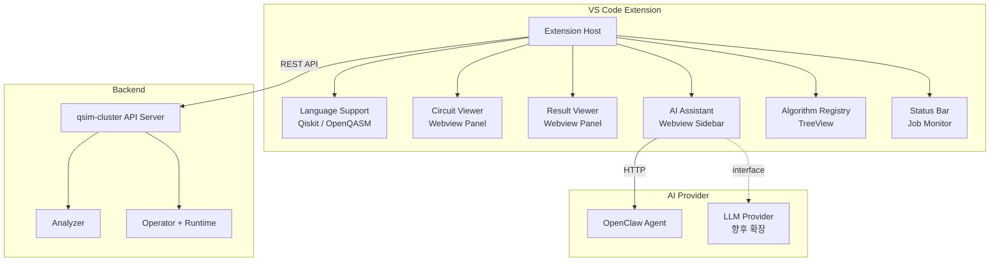

# QSim Studio - Design Document

## 1. 개요

**QSim Studio**는 VS Code Extension 기반 양자 컴퓨팅 개발 환경이다.
qsim-cluster를 백엔드 시뮬레이션 엔진으로 활용하며, 회로 설계 → 시뮬레이션 → 결과 분석까지 통합 워크플로우를 제공한다.

### 핵심 가치
- **통합 개발 환경**: 코드 작성, 회로 시각화, 시뮬레이션, 결과 분석을 하나의 도구에서
- **AI 지원**: 양자 컴퓨팅 개념 설명, 코드 생성, 알고리즘 추천
- **확장 가능**: D-Wave, Cirq, PennyLane 등 다양한 백엔드 지원 가능

## 2. 아키텍처



## 3. 핵심 기능

### 3.1 언어 지원

| 언어 | 파일 확장자 | 기능 |
|------|-----------|------|
| Qiskit (Python) | `.py` | Syntax highlight (기존), Qiskit snippets, import 자동완성 |
| OpenQASM | `.qasm` | 커스텀 문법 정의, syntax highlight, 유효성 검사 |

**확장 예정**: D-Wave Ocean (Python), Cirq (Python), PennyLane (Python)

### 3.2 회로 시각화 (Circuit Viewer)

- **입력**: Qiskit/QASM 코드 → AST 파싱 → 회로 모델
- **렌더링**: SVG 기반 (D3.js)
  - 큐빗 라인 (수평)
  - 게이트 박스 (H, X, Y, Z, CNOT, Toffoli 등)
  - 측정 기호
  - 멀티큐빗 게이트 연결선
- **인터랙션**: 줌/패닝, 게이트 hover 시 정보 표시, 게이트 선택
- **실시간 동기화**: 코드 변경 시 회로 자동 업데이트 (debounce 500ms)

### 3.3 결과 시각화 (Result Viewer)

| 차트 유형 | 용도 |
|----------|------|
| 히스토그램 | Measurement counts 분포 |
| Bloch Sphere | 단일 큐빗 상태 3D 시각화 |
| State Vector | 진폭/위상 bar chart |
| Probability Distribution | 확률 분포 |
| Density Matrix | Hinton diagram |

- Recharts (2D 차트) + Three.js 또는 SVG (Bloch sphere)
- 차트 간 전환 탭
- 데이터 내보내기 (CSV, PNG)

### 3.4 AI Assistant

- **UI**: 사이드바 Webview (채팅 형태)
- **기능**:
  - 양자 컴퓨팅 개념 설명
  - Qiskit/QASM 코드 생성 및 디버깅
  - 알고리즘 추천
  - 에러 분석 및 해결 제안
  - 에디터 컨텍스트 인식 (현재 열린 파일 참조)
- **Provider Pattern**:

```typescript
interface AIProvider {
  id: string;
  name: string;
  sendMessage(message: string, context?: CodeContext): Promise<AIResponse>;
  streamMessage?(message: string, context?: CodeContext): AsyncIterable<string>;
}

// 기본 구현
class OpenClawProvider implements AIProvider { ... }
// 향후 확장
class OpenAIProvider implements AIProvider { ... }
```

### 3.5 알고리즘 레지스트리

```json
{
  "id": "grover-search",
  "name": "Grover's Search Algorithm",
  "category": "search",
  "description": "Quadratic speedup for unstructured search",
  "qubits": 3,
  "difficulty": "intermediate",
  "tags": ["search", "oracle", "amplitude-amplification"],
  "files": {
    "qiskit": "algorithms/grover/grover.py",
    "qasm": "algorithms/grover/grover.qasm"
  }
}
```

- **카테고리**: Search, Optimization, Cryptography, Simulation, Error Correction, Variational
- **내장 알고리즘**: Bell State, Teleportation, QFT, Grover, Shor, VQE, QAOA, Deutsch-Jozsa, Bernstein-Vazirani, Simon
- **UI**: TreeView (카테고리 → 알고리즘), Quick Pick 검색
- **액션**: "Insert to Editor", "Open in New Tab", "Run Simulation"

### 3.6 시뮬레이션 실행

1. 에디터에서 코드 선택 또는 전체 파일
2. `QSim: Run Simulation` 명령 실행
3. qsim-cluster API로 Job 제출
4. Status Bar에 진행 상태 표시 (Submitting → Running → Completed)
5. 완료 시 Result Viewer 자동 오픈

## 4. 기술 스택

| 영역 | 기술 |
|------|------|
| Extension | TypeScript, VS Code Extension API |
| Webview | React 18, Tailwind CSS |
| 회로 렌더링 | D3.js, SVG |
| 결과 차트 | Recharts |
| Bloch Sphere | Three.js 또는 SVG |
| 번들링 | esbuild |
| 테스트 | Jest, @vscode/test-electron |

## 5. Extension 구조

```
qsim-studio/
├── docs/
│   └── DESIGN.md
├── src/
│   ├── extension.ts              # Entry point
│   ├── commands/                  # Command handlers
│   │   ├── runSimulation.ts
│   │   ├── openCircuitViewer.ts
│   │   └── openAIChat.ts
│   ├── providers/                 # Backend providers
│   │   ├── types.ts               # Provider interfaces
│   │   ├── qsimProvider.ts        # qsim-cluster API client
│   │   ├── aiProvider.ts          # AI provider interface
│   │   └── openclawProvider.ts    # OpenClaw implementation
│   ├── language/                  # Language support
│   │   ├── qasmLanguage.ts        # QASM language definition
│   │   ├── qiskitSnippets.ts      # Qiskit code snippets
│   │   └── completionProvider.ts
│   ├── circuit/                   # Circuit model & parser
│   │   ├── parser.ts              # Code → Circuit model
│   │   └── types.ts               # Circuit data types
│   ├── registry/                  # Algorithm registry
│   │   ├── registryProvider.ts    # TreeView data provider
│   │   └── algorithms.json        # Built-in algorithms
│   └── webview/                   # Webview panels (React)
│       ├── circuit-viewer/
│       ├── result-viewer/
│       └── ai-chat/
├── algorithms/                    # Algorithm template files
│   ├── bell-state/
│   ├── grover/
│   └── ...
├── syntaxes/                      # TextMate grammars
│   └── qasm.tmLanguage.json
├── package.json
├── tsconfig.json
├── esbuild.js
└── README.md
```

## 6. Provider Pattern (확장성)

```typescript
// Simulation Provider
interface SimulationProvider {
  id: string;
  name: string;
  submitJob(code: string, options: SimulationOptions): Promise<JobHandle>;
  getJobStatus(jobId: string): Promise<JobStatus>;
  getJobResult(jobId: string): Promise<SimulationResult>;
  cancelJob(jobId: string): Promise<void>;
}

// 기본: qsim-cluster
class QSimProvider implements SimulationProvider { ... }
// 확장: D-Wave
class DWaveProvider implements SimulationProvider { ... }
// 확장: IBM Quantum
class IBMQuantumProvider implements SimulationProvider { ... }
```

## 7. 개발 로드맵

| PR | 내용 | 의존성 |
|----|------|--------|
| #1 | Extension 골격 + 명령어 등록 | - |
| #2 | OpenQASM 언어 지원 (syntax, snippets) | #1 |
| #3 | Qiskit snippets + completion | #1 |
| #4 | 회로 시각화 Webview | #1 |
| #5 | qsim-cluster API 연동 + 시뮬레이션 실행 | #1 |
| #6 | 결과 시각화 Webview | #5 |
| #7 | AI Assistant 채팅 UI + OpenClaw 연동 | #1 |
| #8 | 알고리즘 레지스트리 | #1 |
| #9 | 통합 테스트 + .vsix 패키징 | All |
